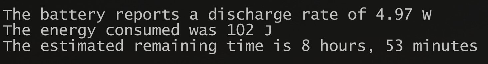

# PowerDeck

Advanced power management plugin for handheld gaming devices and Steam Deck.

## Introduction

PowerDeck provides comprehensive power management for Steam Deck and similar handheld gaming devices. The plugin automatically adjusts thermal design power (TDP), CPU performance, and GPU frequencies based on whether your device is running on AC power or battery. Individual games can have their own power profiles, ensuring optimal performance for each title while maximizing battery life.

The plugin operates seamlessly in the background, detecting power source changes and applying appropriate settings without user intervention. Profile changes are immediate and persistent across device restarts.

## Screenshots

PowerDeck running on the AYANEO Flip:

<div align="left">
  
  <br/>
  <em>No Man's Sky, 720p/30, FSR: Performance</em>
</div>

<br>

<div align="left">
  
  <br/>
  <em>SteamWorld Dig</em>
</div>

<br>

<div align="left">
  
  <br/>
  <em>AYANEO Flip, 4.97w Idle</em>
</div>

## Features

### Automatic Power Profile Management
- Real-time detection of AC adapter connection and removal
- Instant switching between AC and battery power profiles
- Per-game profiles with separate AC and battery configurations
- Automatic profile inheritance for games without custom settings

### CPU and Thermal Control
- Thermal Design Power (TDP) adjustment within safe hardware limits
- CPU boost enable/disable for performance versus battery optimization
- CPU core count management for power efficiency
- CPU frequency governor selection
- CPU Energy Performance Preference (EPP) control

### GPU Frequency Management
- Integrated GPU frequency control for Intel and AMD processors
- Minimum and maximum frequency range configuration
- Fixed frequency mode for consistent performance
- Hardware-appropriate stepping for Intel GPU compatibility

### System Power Management
- CPU simultaneous multithreading (SMT) control
- PCIe Active State Power Management configuration
- USB device power management
- System governor and power profile selection

### Profile System
- Individual profiles stored as JSON files
- Base profiles for general AC and battery use
- Game-specific profiles override base settings
- Profile settings survive device restarts and plugin updates

## License

This project is licensed under the GNU General Public License v3.0. See the LICENSE file for complete terms.

## Compatibility

### Supported Devices
- AYANEO handheld devices (2S, Air Pro, Flip KB, and others)
- ASUS ROG Ally and ROG Ally X
- Various generic AMD handheld devices with supported processors
- Various Intel-based handheld devices with integrated graphics

### Supported Processors

**AMD Processors:**
- AMD Ryzen Z1 and Z1 Extreme
- AMD Ryzen Z2 and Z2 Extreme
- AMD Phoenix series (7840U, 7640U, 7540U, 7440U)
- Steam Deck custom APU
- Additional AMD processors with integrated graphics

**Intel Processors:**
- 8th Generation Intel Core processors with integrated graphics
- 9th through 12th Generation Intel Core processors
- Intel Iris Xe graphics support
- Various Intel processors with frequency control capabilities

### Operating System Requirements
- SteamOS 3.0 or later
- Linux distributions with sysfs interface support
- Decky Loader plugin framework installed

## System Requirements

### Hardware Requirements
- Handheld gaming device with supported AMD or Intel processor
- Integrated graphics (AMD RDNA/RDNA2 or Intel Iris Xe)
- At least 10MB available storage space

### Software Dependencies
- Decky Loader plugin system
- Python 3.8 or later
- RyzenAdj utility for AMD TDP control (automatically installed)
- Linux kernel with sysfs power management interface

### Security Requirements
- Secure Boot must be disabled for TDP control functionality
- Root access required (plugin operates with elevated privileges)
- Administrative permissions for hardware control

## Installation

### Automatic Installation

The simplest installation method uses the automated installer script:

```bash
curl -L https://raw.githubusercontent.com/fewtarius/PowerDeck/main/install.sh | sh
```

After running the installer:
1. Restart the Decky Loader service: `sudo systemctl restart plugin_loader`
2. Reboot your device to ensure all components are loaded
3. Access PowerDeck through the Decky Loader overlay

### Manual Installation

If you prefer manual installation or the automatic method fails:

1. Download the latest release:
   ```bash
   wget https://github.com/fewtarius/PowerDeck/releases/latest/download/PowerDeck.zip
   ```

2. Extract to the plugins directory:
   ```bash
   sudo unzip PowerDeck.zip -d $HOME/homebrew/plugins/PowerDeck
   sudo chown -R deck:deck $HOME/homebrew/plugins/PowerDeck
   ```

3. Restart services:
   ```bash
   sudo systemctl restart plugin_loader
   sudo reboot
   ```

### Verification

After installation, verify PowerDeck is working:

1. Open the Decky Loader overlay (Quick Access menu)
2. Look for PowerDeck in the plugins list
3. The plugin should display your device information and current power settings
4. Test AC power detection by plugging or unplugging your AC adapter

### Troubleshooting Installation

**Plugin not appearing in Decky Loader:**
- Verify Decky Loader is installed and running
- Check that plugin files are in the correct directory
- Restart the plugin loader service

**TDP control not working:**
- Ensure Secure Boot is disabled in BIOS/UEFI settings
- Verify RyzenAdj is installed and accessible
- Check that the plugin has root privileges

**Profile changes not persisting:**
- Confirm write permissions to the configuration directory
- Verify sufficient disk space for profile storage

## Uninstallation

To remove PowerDeck:

1. Stop the plugin loader:
   ```bash
   sudo systemctl stop plugin_loader
   ```

2. Remove plugin files:
   ```bash
   sudo rm -rf $HOME/homebrew/plugins/PowerDeck
   ```

3. Remove configuration data (optional):
   ```bash
   rm -rf ~/.config/powerdeck
   sudo rm -rf /root/.config/powerdeck
   ```

4. Restart the plugin loader:
   ```bash
   sudo systemctl start plugin_loader
   ```

The uninstallation is complete. Your device will return to default power management behavior after the next reboot.
