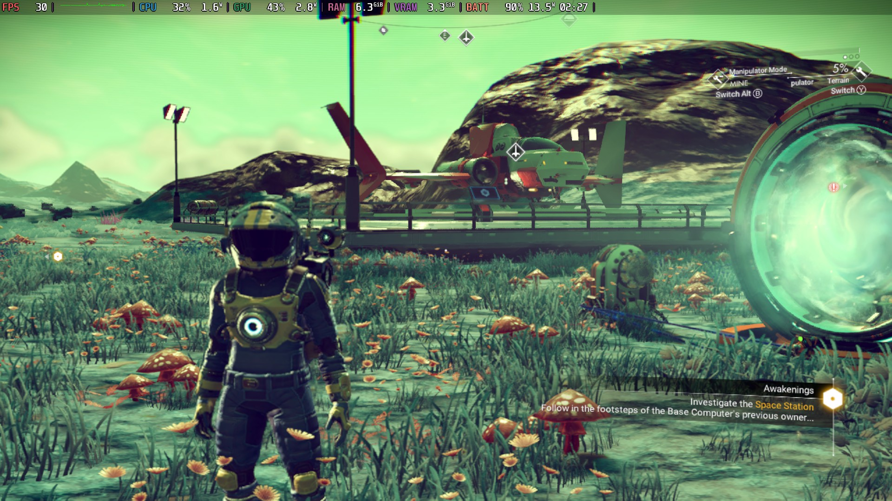
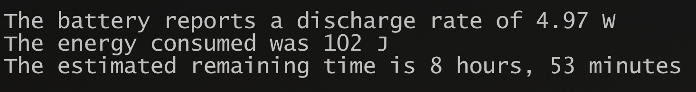

# PowerDeck

Advanced power management plugin for handheld gaming PCs and AMD desktop APUs.

## Introduction

PowerDeck provides per-game, per-power-source TDP, CPU, and GPU tuning for handheld gaming PCs and AMD Strix Halo / Ryzen AI MAX mini-PCs. The plugin detects AC versus battery and applies the right profile automatically. Each game can have its own profile, so you get max performance on AC and longer battery life unplugged without touching settings.

Profiles are written as JSON files in `~/.config/powerdeck/profiles/` and survive plugin updates and reboots. The plugin runs as root because it talks directly to AMD's System Management Unit (SMU) via `ryzenadj`.

## Screenshots

PowerDeck running on the AYANEO Flip:

<div align="left">
  
  <br/>
  <em>No Man's Sky, 720p/30, FSR: Performance</em>
</div>

<br>

<div align="left">
  
  <br/>
  <em>SteamWorld Dig</em>
</div>

<br>

<div align="left">
  
  <br/>
  <em>AYANEO Flip, 4.97w Idle</em>
</div>

## Features

### Automatic Power Profile Management
- Real-time detection of AC adapter connection and removal
- Instant switching between AC and battery power profiles
- Per-game profiles with separate AC and battery configurations
- Automatic profile inheritance for games without custom settings

### CPU and Thermal Control
- Thermal Design Power (TDP) adjustment within safe hardware limits
- CPU boost enable/disable for performance versus battery optimization
- CPU core count management for power efficiency
- CPU frequency governor selection
- CPU Energy Performance Preference (EPP) control via amd-pstate-epp

### GPU Frequency Management
- Integrated GPU frequency control for Intel and AMD processors
- Minimum and maximum frequency range configuration
- Fixed frequency mode for consistent performance
- AMD `power_dpm_force_performance_level` switching (with JELOS safety net)
- Hardware-appropriate stepping for Intel GPU compatibility

### System Power Management
- CPU simultaneous multithreading (SMT) control
- PCIe Active State Power Management configuration
- USB device power management
- System governor and EPP profile selection

### Profile System
- Individual profiles stored as JSON files
- Base profiles for general AC and battery use
- Game-specific profiles override base settings
- Profile settings survive device restarts and plugin updates

### Strix Halo Desktop APU Support
- Full TDP control on Ryzen AI MAX 300 series (Strix Halo, Zen 5)
- `tctl-temp` thermal limit (the family has no APU skin temperature sensor)
- Radeon 8060S / 8050S iGPU frequency control via amdgpu sysfs
- cTDP range 45-120W per AMD spec, up to 130W on some boards (Beelink GTR9 PRO, Framework Desktop)
- Works on JELOS via `iomem=relaxed` kernel cmdline for direct SMU access

## License

This project is licensed under the GNU General Public License v3.0. See the LICENSE file for complete terms.

## Compatibility

### Supported Devices

#### Handhelds
- AYANEO handheld devices (2S, Air Pro, Flip KB / DS / 1S, and others)
- ASUS ROG Ally and ROG Ally X
- Lenovo Legion Go (original and Legion Go S)
- Generic AMD handhelds with supported processors
- Generic Intel handhelds with integrated graphics

#### Strix Halo Desktop / Mini-PCs
- ASUS ROG Flow Z13 (2025) — GZ302
- Nimo Axis N161L
- Framework Desktop
- Beelink SER9 / GTR9
- Minisforum AI X1 / MS-A2
- HP Z2 Mini G1a
- Any other AMD Strix Halo system with DMI detection or via `strix_halo_desktop` fallback

#### Other
- Generic AMD systems with `ryzenadj` support
- Generic Intel systems with RAPL power capping

### Supported Processors

#### AMD

**Ryzen AI MAX 300 Series (Strix Halo, Zen 5 desktop APUs)**
- Ryzen AI MAX+ 395 (16C/32T, Radeon 8060S 40 CU, cTDP 45-120W)
- Ryzen AI MAX+ PRO 395 (16C/32T, Radeon 8060S 40 CU)
- Ryzen AI MAX 390 (12C/24T, Radeon 8060S)
- Ryzen AI MAX 385 (8C/16T, Radeon 8050S 32 CU)
- Ryzen AI MAX PRO 380 / 385 / 390

**Ryzen AI 300 Series (Strix Point / Krackan Point, Zen 5 mobile)**
- Ryzen AI 9 HX 370 / HX 375 / HX PRO 370 / HX PRO 375
- Ryzen AI 9 365
- Ryzen AI 7 350 / PRO 350 / PRO 360
- Ryzen AI 5 330 / 340 / PRO 340

**Ryzen Z2 Series (handhelds)**
- Ryzen Z2 Extreme
- Ryzen AI Z2 Extreme
- Ryzen Z2
- Ryzen Z2 A
- Ryzen Z2 Go

**Ryzen Z1 Series (handhelds)**
- Ryzen Z1 Extreme
- Ryzen Z1

**Ryzen 7000 / 8000 / Phoenix / Hawk Point Series**
- Ryzen 7 7840U / 7640U / 7540U / 7440U (Phoenix)
- Ryzen 7 7840HS / 7640HS (Phoenix-HS)
- Ryzen Z1 / Z1 Extreme

**Steam Deck**
- AMD Custom APU 0405 (LCD)
- AMD Custom APU 0932 (OLED)

**Other AMD processors** with `ryzenadj` SMU support and integrated graphics

#### Intel
- 8th through 13th Generation Intel Core processors with integrated graphics
- Intel Iris Xe / Iris Plus graphics support
- Various Intel processors with RAPL power capping

### Operating System Requirements
- SteamOS 3.0 or later (Decky Loader required)
- JELOS (SteamOS Holo variant) with `iomem=relaxed` kernel cmdline for Strix Halo SMU access
- SteamFork 3.8+ (jelos-manager daemon supports DBus power negotiation)
- Linux distributions with sysfs interface support and `ryzenadj` available

## System Requirements

### Hardware Requirements
- Handheld gaming device with supported AMD or Intel processor, OR
- AMD Strix Halo (Ryzen AI MAX 300 series) desktop / mini-PC
- Integrated graphics (AMD RDNA / RDNA 2 / RDNA 3 / RDNA 3.5 or Intel Iris Xe)
- At least 10MB available storage space

### Software Dependencies
- Decky Loader plugin system
- Python 3.8 or later
- `ryzenadj` utility for AMD TDP control (auto-installed on most distros; JELOS ships 0.19+)
- Linux kernel with sysfs power management interface (`/sys/class/drm`, `/sys/devices/system/cpu/cpufreq`)
- `amd-pstate-epp` driver recommended for full EPP control on Zen 2+

### Security Requirements
- Secure Boot must be disabled in BIOS/UEFI for TDP control (or `iomem=relaxed` kernel parameter set, as JELOS does by default)
- Root access required (plugin operates with elevated privileges; runs as root via Decky Loader)
- `/dev/mem` MMIO access for `ryzenadj` (configured automatically on JELOS)

## Installation

### Automatic Installation

```bash
curl -L https://raw.githubusercontent.com/fewtarius/PowerDeck/main/install.sh | sh
```

After running the installer:
1. Restart the Decky Loader service: `sudo systemctl restart plugin_loader`
2. Reboot to ensure all components are loaded
3. Access PowerDeck through the Decky Loader overlay

### Manual Installation

1. Download the latest release:
   ```bash
   wget https://github.com/fewtarius/PowerDeck/releases/latest/download/PowerDeck.zip
   ```

2. Extract to the plugins directory:
   ```bash
   sudo unzip PowerDeck.zip -d $HOME/homebrew/plugins/PowerDeck
   sudo chown -R deck:deck $HOME/homebrew/plugins/PowerDeck
   ```

3. Restart services:
   ```bash
   sudo systemctl restart plugin_loader
   sudo reboot
   ```

### Verification

1. Open the Decky Loader overlay (Quick Access menu)
2. Look for PowerDeck in the plugins list
3. The plugin should display your device and current power settings
4. Test AC power detection by plugging or unplugging your adapter
5. Verify TDP control: open a game profile and adjust the TDP slider, then check `ryzenadj -i` to confirm the SMU picked up the change

### Troubleshooting Installation

**Plugin not appearing in Decky Loader:**
- Verify Decky Loader is installed and running
- Check that plugin files are in the correct directory
- Restart the plugin loader service

**TDP control not working on AMD:**
- Check `ryzenadj -i` from a shell — if it errors with "PCI Bus is not writeable", Secure Boot is on or the kernel lacks `iomem=relaxed`
- Verify `ryzenadj` is installed and accessible: `which ryzenadj`
- Check that the plugin has root privileges (Decky Loader runs as root by default)
- On Strix Halo, the `--apu-skin-temp` option is unsupported (PowerDeck detects this and skips it automatically); check `journalctl -u plugin_loader` for "Skipping --apu-skin-temp" messages

**Profile changes not persisting:**
- Confirm write permissions to `~/.config/powerdeck/`
- Verify sufficient disk space for profile storage

**Wrong CPU detected (e.g. Ryzen AI MAX 395 showing up as 3950X):**
- This was a bug in v1.0.47 and earlier. v1.0.48+ detects Ryzen AI families correctly. Upgrade.

**TDP slider doesn't move on Strix Halo:**
- PowerDeck v1.0.47 had a bug where `--apu-skin-temp` was passed unconditionally and caused ryzenadj to exit with rc=255 even when STAPM/PPT writes succeeded. Fixed in v1.0.48. Upgrade.

## Uninstallation

1. Stop the plugin loader:
   ```bash
   sudo systemctl stop plugin_loader
   ```

2. Remove plugin files:
   ```bash
   sudo rm -rf $HOME/homebrew/plugins/PowerDeck
   ```

3. Remove configuration data (optional):
   ```bash
   rm -rf ~/.config/powerdeck
   ```

4. Restart the plugin loader:
   ```bash
   sudo systemctl start plugin_loader
   ```

The device returns to default power management behavior after the next reboot.
